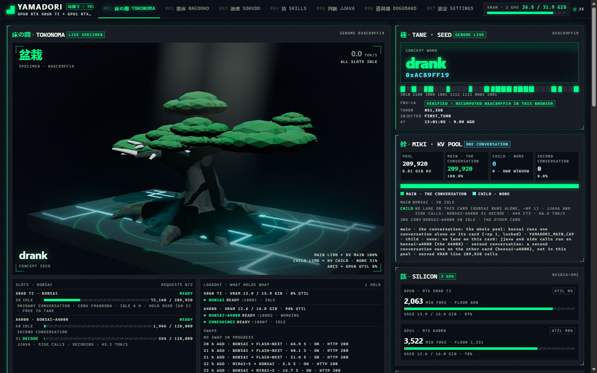

<div align="center">

# 山採り · YAMADORI

**Collected, not bought.**

</div>

---

A *yamadori* is a tree taken off the mountain. Nobody grew it. Nobody potted
it. The wind bent it, the rock starved it, lightning took a limb. Collectors
prize it over nursery stock for exactly that reason: the damage is the
provenance.

Then someone spends thirty years deciding which branches live.

This is that, for models. Open weights, taken as found: a ternary 27B and two
roughly-2-bit models that other people squeezed, a draft head grafted on,
nobody asked. Running on iron you own, shaped for your work, by you. Nobody
can revoke it, meter it, or deprecate it out from under you.

(It used to say *abliterated* here. An abliterated trunk was the main model
until 2026-09-27; it showed no gain, and the original trunk replaced it
(`models/manifest.yaml`). None of the language models that run now is
abliterated; the one ablated file left is the image model's text encoder, a
Qwen3-VL "Heretic" variant.)

<div align="center">



*TOKONOMA, the live view of the author's running stack. SOKUDO (speed) is further down.*

</div>

## The bet

Big models are grown. Yours is **shaped**.

A frontier model answers once, because every answer is billed. Yours answers
as many times as you want, because it costs nothing. Give it a compiler and
that stops being a party trick:

> **Sixteen tries and a compiler beats one try and a genius.**

That is the whole thesis. Everything here serves it, and not all of it has
earned it yet ("What it refuses to claim", below).

## The craft

Bonsai has a vocabulary for cutting things away, and it fits.

| | |
|---|---|
| **剪定 · sentei** | Pruning. Eight tools on the MCP surface; the model sees your client's tools plus a few of ours (images, package lookups, the craft lookup). `judge` was cut at 6/10 against a coin flip; deep thinking, fan-out and the fix-up were cut on 2026-09-29 ([docs/REMOVED.md](docs/REMOVED.md)). |
| **芽摘み · metsumi** | Bud-pinching. Sample many answers, keep the one that compiles. Tried as fan-out: a clean null (7/8 against 7/8, n=8, three times the wall clock), and cut. The thesis above is still a bet, not a receipt. |
| **舎利 · shari** | Deadwood, bleached and kept. Every failed idea stays in the repo with its evidence. |
| **根張り · nebari** | Root flare. Retrieval you can see: `taproot`, `branch`, `shoot`. |
| **年輪 · rings** | Growth rings. A work log that outlives the context window. |
| **床の間 · tokonoma** | The alcove. Where the tree gets displayed: the dashboard. |

## What it is

One server on one port that looks like a standard model, and is a stack of
them. You point any OpenAI, Anthropic or Responses client at it; the client
sees a model called `yamadori`, and one dial, `reasoning_effort`.

- **Three models, picked by effort.** Bonsai for `minimal` to `high`, Mirai S
  for `xhigh`, Flash-Next for `max`; a higher tier swaps in on the main card
  and waits for lower-tier work rather than cancelling it.
- **One conversation per card, never a second one in the way.** The main card
  holds one conversation's whole window. A second conversation, the decider
  and every side call run on the other card (`bonsai-a4000`).
- **One cache.** Whatever the proxy adds to a conversation (a seed word, a work
  log, a tool's hidden hop, even the model's own past reasoning) is recorded
  and replayed byte for byte, so the model's prompt cache is never broken by
  it. The client never learns any of this; it thinks it added a model.
- **A decider that is not the model.** *jjava* answers typed questions about a
  state at one token per option, in TypeSafe's public Jev API shape
  (`/jev/v1/systemone`), beside the generating model and never in its context.
- **Tools that move the task forward.** The exact names, versions, peer
  dependencies and READMEs of the packages you use, looked up in the
  registries when the model asks; pictures drawn and looked at. Your own code
  stays with your client: the model reads it through your harness's file
  tools, and the server never looks at your disk.
- **Skills, proven before they ship.** Package know-how distilled from docs
  through one pipeline and checked by code before it is armed, delivered where
  the model already is: in the result of the package lookup it just made, and
  when it asks `yama_recall_craft` a question. (The library is yours to build;
  see below.)

## Architecture

```
  client (Claude Code, Codex, OpenCode, Pi, Hermes, the OpenAI SDK, curl ...)
     |   /v1/chat/completions   /v1/responses   /v1/messages   /jev/v1/systemone
     v
  proxy :1234   mcp/server.py (transport) + mcp/proxy.py (logic)
     |   auth, effort -> tier -> model, the ledger (byte-for-byte replay), compaction,
     |   slots (one conversation per card), hidden tool hops, jjava, the dashboard at /
     v
  llama-swap :11434 (loopback only; no auth of its own)
     |
     +-- main card (16 GB) ....... bonsai | mirai-s | flash-next   one at a time, swapped
     |
     +-- second card (16 GB) ..... bonsai-a4000 (jjava, side calls, a second conversation)
                                   bonsai-vision, imagegen[-turbo]   on demand
                                   embeddings                        resident

  tools API :1235 ... the same code-search tools over HTTP, for your own software
  worker .......... durable job queue (skills, package onboarding, indexing)
  Docker (optional) PackageLens + the npm resolver, behind an egress gate
```

## Hardware, and what is optional

Built and measured on: Windows 11, **two NVIDIA GPUs of 16 GB** (an RTX 5060 Ti
for the main model, an RTX A4000 for everything else), 64 GB RAM. One card is
not a supported layout. Required: that, an NVIDIA driver, Python 3.13, Git.
Optional: Visual Studio 2022 and CUDA 12 (only to build the engines, which have
no prebuilt binaries), Docker Engine (package lookups), Caddy (TLS). Disk is
about 12 GB for the Bonsai tiers; Mirai S adds 10, images 15, Flash-Next about 66.
Everything is spelled out, with what the installer cannot do for you, in
**[docs/INSTALL.md](docs/INSTALL.md)**.

## Quick start

```powershell
git clone https://github.com/thejustinwalsh/yamadori
cd yamadori
powershell -ExecutionPolicy Bypass -File scripts\install.ps1 -DryRun   # read-only: checks, and what each step would do
powershell -ExecutionPolicy Bypass -File scripts\install.ps1           # asks before every download and build
scripts\start-stack.bat
```

The installer checks prerequisites, makes `.venv`, writes `stack.env` and
`config.yaml` (rendered from `config.example.yaml`), fetches the pinned models
(sha256-verified), builds the engines from the vendored source, and creates an
API key. It has been run here in dry-run only; a first full install on a new
machine will find things we have not. [docs/INSTALL.md](docs/INSTALL.md) says
where.

Then any client:

```bash
curl http://127.0.0.1:1234/v1/chat/completions \
  -H "Authorization: Bearer $(cat .keys/me.key)" -H "Content-Type: application/json" \
  -d '{"model":"yamadori","reasoning_effort":"medium","messages":[{"role":"user","content":"hello"}]}'
```

```python
from openai import OpenAI
c = OpenAI(base_url="http://127.0.0.1:1234/v1", api_key=open(".keys/me.key").read().strip())
c.chat.completions.create(model="yamadori", reasoning_effort="high",
                          messages=[{"role": "user", "content": "..."}])
```

Claude Code: `ANTHROPIC_BASE_URL=http://127.0.0.1:1234`, `ANTHROPIC_AUTH_TOKEN=<key>`
(its effort picks the tier; see [docs/ANTHROPIC-CONFORMANCE.md](docs/ANTHROPIC-CONFORMANCE.md)
for what has and has not been run). Codex, OpenCode, Pi and Hermes are in
[docs/HARNESSES.md](docs/HARNESSES.md) and the `HARNESS-*.md` pages beside it.

## The APIs

| | |
|---|---|
| `POST /v1/chat/completions` | OpenAI chat, streamed or not; every decision comes back as `x_yamadori` |
| `POST /v1/responses`, `GET` / `DELETE /v1/responses/{id}` | OpenAI Responses (Codex's wire). Stored responses: `store` and `previous_response_id` work, kept locally per account (256 MB per account, 2 GB total, 30 days) |
| `POST /v1/messages`, `/v1/messages/count_tokens` | Anthropic Messages (Claude Code): thinking blocks, tool use, `output_config.effort` mapped to the tier |
| `POST /jev/v1/systemone`, `GET /jev/v1/models` (and `/v1/systemone`) | TypeSafe's Jev API, answered by jjava ([docs/JEV-CONFORMANCE.md](docs/JEV-CONFORMANCE.md)) |
| `GET /v1/models` | one model, `yamadori`; any name you send that we do not know resolves to it |
| `/` | the dashboard (a browser); any other client gets the JSON service descriptor |
| `:1235` | the code-intelligence HTTP API ([docs/TOOLS-API.md](docs/TOOLS-API.md)) |

Every route but `/health` needs an account key (`Authorization: Bearer`, or
`x-api-key` on `/v1/messages`) once one exists. Conformance notes, with what each
choice was based on: [OPENAI](docs/OPENAI-CONFORMANCE.md),
[ANTHROPIC](docs/ANTHROPIC-CONFORMANCE.md), [JEV](docs/JEV-CONFORMANCE.md).

## Effort tiers

The standard `reasoning_effort` field is the only switch a client needs. Each
tier says what the service may add (`mcp/tiers.py`, `TIERS`) and which model
answers (`mcp/tier_models.yaml`); every decision comes back on the response as
`x_yamadori`.

| `reasoning_effort` | thinking | skills | MCP tools | images | concept seed | model | adds |
|---|---|---|---|---|---|---|---|
| `minimal` | off | – | – | yes | – | Bonsai | the fastest answer: no thinking, nothing of ours (least injection-resistant) |
| `low` | on | – | – | yes | yes | Bonsai | the concept seed only: the model's own thinking plus the seed (2026-10-06) |
| `medium` | on | – | yes | yes | yes | Bonsai | the MCP host's package lookups (and the proven skills that ride in their results), and the concept seed |
| `high` | on | – | yes | yes | yes | Bonsai | the same as `medium`: a concept seed on the conversation's first user turn |
| `xhigh` | on | – | yes | yes | yes | Mirai S | the same as `high`, on a different model (Mirai S): the effort-matched pair to `max` |
| `max` | on | – | yes | yes | yes | Flash-Next | everything, with the longest thinking (slowest) |

- **Concept seed:** one word drawn from the model's own vocabulary, once per
  conversation, appended to its first user turn so the conversation starts
  somewhere the model would not otherwise go; `x_yamadori.session.seed` names it.
- **Skills column:** the per-turn skill *injection* is off at every tier (the
  operator, 2026-09-29: until there is a good injector). The package-skills
  channel (skills riding in package-tool results, and `yama_recall_craft`) is a
  separate switch, on from `medium`.
- **Swaps:** `max` > `xhigh` > the Bonsai tiers. A higher tier's request waits for
  lower-tier work and then takes the card; a lower tier's request gets 503
  `model_at_capacity` with `Retry-After` while a higher one holds it. A
  Flash-Next load was measured at 131-272 s.
- **Default:** `medium`, when a client sends nothing. **Accepted values:** the six
  names above (and `yamadori-fast`, `-xhigh`, `-max` as model names); anything
  else gets the default, never an error.
- **Thinking budget:** not set by the tier. It comes from the request's share of
  the KV pool, minus the prompt and the answer allowance, capped per kind of turn
  (`mcp/tiers.py`, `mcp/budget.py`).
- **Models you do not have:** `xhigh` and `max` need Mirai S and Flash-Next
  installed; without them a request at those efforts fails.

Removed 2026-09-29 ([docs/REMOVED.md](docs/REMOVED.md); the way back is commit
`e360d37`): the second brain (deep thinking, fan-out, the fix-up and its
"Verified / Repaired" notes), the addendum, library definitions, Laya and CLM.
They were tried and did not help.

## Models

Clients on `:1234` see `yamadori`. The ids below are llama-swap's, on loopback
`:11434` behind the proxy; `config.example.yaml` is the real config, and
[docs/MODELS.md](docs/MODELS.md) says where every file came from.

| id | what | card | notes |
|---|---|---|---|
| `bonsai` (alias `bonsai-agent`) | Ternary Bonsai 2 27B (PTQ1_0, Qwen3.8 base) with ProCreations' MTP head grafted on | main | thinking ON; 209,920-cell window, all in VRAM; one conversation |
| `mirai-s` | Mirai S Qwen3.8-27B, 2.4-bit trellis (a third-party GGUF of Mirai Labs' checkpoint) | main, swaps with `bonsai` | the `xhigh` tier; 125,952 cells |
| `flash-next` | Qwen3.8-Flash-Next IQ2_XS (125B MoE, 6B active), experts in RAM | main, swaps | the `max` tier; 262,144 cells |
| `bonsai-a4000` | the original Bonsai trunk, no MTP | second | jjava, side calls and a second conversation; 128,000 cells |
| `bonsai-vision` | the trunk + the multimodal projector | second, on demand (ttl 300) | what looks at an attached image |
| `embeddings` | Qwen3-Embedding-0.6B | second, resident | code search, the skills |
| `imagegen`, `imagegen-turbo` | Qwen-Image-2.1 Q5_K_M (20 steps / a 4-step distilled student) via stable-diffusion.cpp | second, on demand (ttl 600) | `yama_generate_image`; Qwen Research License |

**`bonsai-agent` is an alias and nothing more.** Thinking is ON for both ids.
(The reversal is left visible: an earlier version forced it OFF because the
model seemed never to emit a tool call. That was measured on a corrupt
`pr-ptq1-mmv` build and did not survive fixing the fork: 13/15 correct with
thinking off against 12/15 on, 0/15 failures to call either way, 5 tasks x 3
reps.) Thinking stays on for prompt injection: against one naive exfiltration
payload, off leaked 5/5 and on at temperature 0.3 leaked 1/5, on the abliterated
build the stack ran then, and **1/5 is a reduction, not a defence**; the real
controls are architectural (no irreversible capability without confirmation, read
and write on separate credentials, untrusted content never sharing a channel with
instructions).

## jjava, and the Jev API

*jjava* is our name for the decider: Bonsai on the second card, reading typed
questions (a yes/no *noul*, a *choice*, a *score*) over one state at one token
per option and returning probabilities. Code acts on the answers; its
output is never text in the generating model's context
([docs/JJAVA.md](docs/JJAVA.md)). The same engine answers TypeSafe's public Jev
API (`/jev/v1/systemone`), checked offline against both of TypeSafe's SDKs.

Measured on JevBench (231 items, all run, `bonsai-a4000`, readout `typed/2`):
public intelligence **80.46**, against the published Jev 1.13.0's 82.25 on the
same harness (`bench/decider/results/jevbench/bonsai-a4000-20261006-193326/summary.json`).
Latency p50 1.08 s, p95 4.75 s on a shared card; the file says why that is not
comparable with theirs. The one-pass batched read (`POST /decide-batch`, engine
patch 0042) is on in the launcher (`YAMADORI_DECIDER_BATCH=1`).

## Skills

A skill is an Agent Skills folder (`SKILL.md` plus tests): facts, proven
patterns, and concrete pitfalls ("do not cast with `as any`") about a library,
in an assured voice with no doubt in it. One pipeline makes them: fetch, screen
(for injection), distil, review, classify, write activation tests, validate,
**prove**, arm, with the source's licence recorded as provenance. PROVE answers 2-3 probes with and without the skill and
checks the answers by code (does it parse, is the DO present and the DO NOT absent,
does it type-check against the held package version); worse on any check
quarantines the skill ([docs/SKILL-FACTORY.md](docs/SKILL-FACTORY.md)).

They reach the model where it already is: in the result of the package lookup that
named the package, and when the model asks `yama_recall_craft` a question (an
embedder shortlists, jjava chooses, a relevance gate decides). Choosing among ~500
skills from a first prompt did not work (on-topic against off-topic AUROC 0.92,
needed against same-area 0.63, 193 labelled cases); an exact package name out of
a tool call is a fact. **The library the author built is derived data and is not in
this repository**; the pipeline is. A fresh install has nothing armed.

## The dashboard

<div align="center">


*SOKUDO, from llama-server's own timings on real traffic.*

</div>

Seven pages: TOKONOMA (the live bonsai, the concept seed, the KV pool, the slots,
what holds what on each GPU), NAEDOKO (the seedbed: datasets moving through the
pipeline), SOKUDO (speed), SKILLS, JJAVA (the decider's use, the Jev API), DOGUBAKO
(the toolbox: what to put into each harness) and SETTINGS. It is a React app in `web/`; the committed `web/dist` is served at `/`.
A view never loads a model: every read asks llama-swap what is loaded first
([docs/DASHBOARD.md](docs/DASHBOARD.md)). To refresh the screenshots above:
`node scripts/dashboard_screenshots.mjs docs/img` (Node 24 and Edge, the stack
running, a key in `.keys/live-test.key`).

## Performance

Decode on the main card with nothing else decoding, tokens a second at 8K / 32K /
64K of context:

| model | 8K | 32K | 64K | source |
|---|---|---|---|---|
| `bonsai` (MTP, q8_0 KV) | 73.8 | 72.7 | 73.0 | `bench/kv_rank.py --layout v3`, n=3: `bench/results/kv_rank/20260930-v3` |
| `mirai-s` | 33.7 | 31.2 | 28.2 | `bench/mirai_s_gate.py`, n=3: `bench/results/mirai_s/gate-20261001-merged` |
| `flash-next` | 17-18 at 1-9K, ~15 at 36K | | | [docs/FLASH-NEXT.md](docs/FLASH-NEXT.md) section 8, n=5-9 per shape, 2026-09-29 |

A jjava burst sharing the main card cut Bonsai's decode by about 30% (73.8 to 51.3
at 8K, n=3). That measurement is why layout v3 gives the main card one conversation
and nothing else, and why jjava and the side calls live on the other card.

**One card beats two cards split.** A pipeline split runs the halves sequentially
with an activation handoff, so it costs about 8% (measured on the original
single-model stack: 46.06 tok/s on one card against slower when split). Nothing
here is split across GPUs.

## Two transports for the same tools

MCP is for agents; the HTTP API is for your own software. Identical logic behind
both: `mcp/code_search.py` and `mcp/tools_api.py` import the same module, so they
cannot drift.

```bash
curl "http://127.0.0.1:1235/definition?symbol=parse_tool_call" -H "Authorization: Bearer $KEY"
curl http://127.0.0.1:1235/search -H "Authorization: Bearer $KEY" -H "Content-Type: application/json" \
  -d '{"query":"how are tool calls parsed","top_k":5}'
```

| route | use when |
|---|---|
| `POST /definition` | you know the identifier: sqlite lookup, no GPU |
| `POST /references` | before changing a signature or deleting code |
| `POST /search` | you cannot name it: BM25 + symbols (see note) |
| `GET /status` | index coverage |
| `GET /openapi.json` | self-discovery for tooling |

Every route except `/health` needs the key, and a browser request whose Origin is
not in `YAMADORI_TOOLS_ALLOWED_ORIGINS` is refused. Index a repo with
`python scripts/index_code.py <path>` (the stack running). Client configs for
Claude Code, OpenCode and Hermes are in [docs/TOOLS-API.md](docs/TOOLS-API.md).

> **Retrieval defaults.** `CODE_SEARCH_SEMANTIC=0`, so at shipped defaults
> `/search` runs BM25 plus the symbol table; embeddings are off. BM25 beat the
> embedding index 92 to 77 in our measurement. See [docs/SELECTION.md](docs/SELECTION.md).

## TLS (optional)

`caddy/Caddyfile` terminates TLS on 443 in front of `:1234` and `:1235`. It is the
author's: it names his hostname, which resolves to a private ZeroTier address, so
its certificate comes from Let's Encrypt by **DNS-01** with a DNSimple token
(`caddy/env.example` to `caddy/.env`, gitignored). The launcher starts Caddy only
when a token is present. Edit the hostname and the DNS provider for yours; the stack
runs on the raw ports without it.

## What it refuses to claim

The tree is not finished. It will not be.

Nothing here is asserted without a measurement, and the measurements have
been unkind. BM25 beat the embedding index 92 to 77 and the embeddings got
switched off. Every reranker number turned out to be void, because its
scores change with what else is in the batch (`docs/FINDINGS.md` #20), and
the reranker was removed (2026-10-01, `docs/REMOVED.md`). A fan-out
experiment returned a clean null. And two separate things happened to the
decision model that came before jjava, which used to be written here as one
sentence and are not related:

- **Calibration went nowhere.** Temperature-scaling it on 151 held-out
  contrastive pairs (`index/calibration.json`, `scripts/calibrate_laya.py`,
  deleted with Laya on 2026-09-29 and in git at `e360d37`)
  moved ECE from 0.279 to 0.032 and left accuracy at **0.5066 against a 0.500
  majority baseline the pairs have by construction** -- which is the only
  outcome possible, because a single scalar divisor is monotonic and cannot
  reorder an argmax. Honest confidence, no new capability. `docs/LAYA.md`
  Finding 10.
- **A different tool was cut.** `judge` -- the decision model asked to say
  whether a proposition holds -- scored **6/10 against a 5/10 coin flip** on
  unambiguous yes/no engineering questions (`scripts/eval_judge.py`, also
  deleted with Laya), with three of four misses being false positives on the
  *negative* cases. It is now advertised in no tool list and no longer
  dispatches by name.

Neither caused the other. They are different label sets, different scripts and
different questions.

**This repository is mostly a record of things that did not survive testing.**
That is the point. Every number here names the script that produced it and the
sample size it ran at. Where the sample is too small to carry a claim, it says so.
Much of what is described above was built offline and has not yet run live; the
`AGENTS.md` sections say which, case by case.

The verification loop is still being built. Until it lands, the line at the top
of this file is a promise, not a receipt.

---

## Layout

```
README.md  AGENTS.md  DESIGN.md      what it is; what the code does (the source of truth); the design
config.example.yaml                  llama-swap's config, with @@placeholders@@; make_config.py renders config.yaml
requirements.txt  requirements.lock.txt   what the code imports; the author's whole environment
stack.env                            (gitignored) this machine's interpreter, CUDA runtime, URL
scripts/
  install.ps1        the installer (-DryRun first)          make_config.py   config.yaml from the example
  start-stack.bat    the launcher                            watchdog.ps1     health check and self-heal
  install-autostart.ps1   start at logon + a watchdog        fetch_models.py  pinned models, sha256-verified
  build_engine.py    engines from the vendored source        verify_artifacts.py  what is loaded is what is recorded
  run_tests.py       every offline suite + ruff              deploy_check.py  a deploy is good when this exits 0
engines/
  manifest.yaml      every engine pinned: base commit, patches, flags, shipped hashes
  patches/  src/     our patch series; the vendored source it applies to (docs/ENGINES.md)
models/manifest.yaml every model file: size, sha256, source repo at a full commit, licence (docs/MODELS.md)
mcp/
  server.py          the front door on :1234              proxy.py         the request logic: one turn, the ledger
  tiers.py  tier_models.yaml   effort -> tier -> model    slots.py  max_mode.py   one conversation per card
  responses_api.py  messages_api.py  jev_api.py            the other wires, as translations over the one turn
  decider_bonsai.py  decide_turn.py                        jjava
  mcp_host.py        the MCP client the proxy runs (PackageLens)     package_skills.py  skill_*.py   skills
  code_search.py  tools_api.py   the 8 tools, over MCP and HTTP      worker.py  jobs.py   the durable queue
web/  design/        the React dashboard (web/dist is served); its design source
bench/               the measurements the numbers above name
docs/                everything else; docs/INSTALL.md first
```

Run the tests with `python scripts/run_tests.py` (offline + ruff), then `--live`
through `:1234` before claiming anything works. See `AGENTS.md`.

## Things that will bite you

**Device numbering.** `start-stack.bat` pins `CUDA_DEVICE_ORDER=PCI_BUS_ID`. Without it
CUDA orders devices *fastest-first*, which can reverse two cards and silently put the
main model on the wrong one. Every model in `config.yaml` also sets
`CUDA_VISIBLE_DEVICES` to its card's UUID; keep both if you start anything by hand.

**CUDA DLLs.** `llama-server` loads the CUDA runtime from `PATH`. If it cannot, the
server exits silently with status 0. `YAMADORI_CUDA_BIN` (in `stack.env`) names the
directory `start-stack.bat` prepends.

**Build the vendored engines, not an upstream release.** `PTQ1_0` is a PrismML
quant type and stock llama.cpp rejects it, and picking the wrong fork is worse
than picking none: `sudoingX/llama.cpp` branch `pr-ptq1-mmv` carries a faster
PTQ1_0 decode kernel that is numerically broken. It is ~20% quicker (55.33 against
46.06 tok/s) and collapses generation into runs of `/`, taking tool calling from 9/9
to 0/10. The trees we build are the ones in `engines/src`, each recorded with its
origin in `engines/manifest.yaml`; [docs/KNOWN-ISSUES.md](docs/KNOWN-ISSUES.md) has
the comparison.

**Embeddings are asymmetric.** Qwen3-Embedding needs an instruction prefix on
*queries* and none on documents. Getting it wrong does not error; it silently
returns near-random results. Handled in `mcp/code_search.py`.

**VRAM headroom matters.** A window that loads can still die when a long prefill
allocates its compute buffer: 240k cells loaded on the main card and left ~2% free.
The shipped 209,920-cell window with q8_0 KV (36,992 bytes a cell) sits entirely in
VRAM beside ~6 GB of weights, and the main card is also the Windows display GPU,
which spills to system RAM rather than failing (a silent slowdown). Those numbers
are measurements of one pair of cards (`bench/kv_rank.py`, `bench/a4000_fit.py`,
[docs/ENGINES.md](docs/ENGINES.md) "The VRAM line"). On other cards, re-measure; do
not copy `-c`.

**The main model is a graft.** The file `bonsai` loads is a local build (the original
trunk plus an MTP head), not a download; the installer's quick path substitutes a
published file that carries its own head. [docs/INSTALL.md](docs/INSTALL.md).

**`xhigh` and `max` need their models.** Mirai S and Flash-Next are optional installs;
Flash-Next also needs two files that are recipes, not downloads, and a launch line tuned
to the author's CPU.

**PackageLens needs its image id recorded.** A rebuild of its container gets a new id,
and the proxy only starts the image `models/manifest.yaml` records.

## Not included, and why

**Adversarial critic.** A second 27B with *different* weights reviewing the primary's
output is the highest-value addition, but at Q4_K_M it needs ~19.7 GiB (weights, KV,
compute buffer, MTP) and will not fit on a 16 GiB card beside anything. It needs a
~12 GiB quant. (The disabled entry is in git history; it is not in `config.example.yaml`.)

**A second chat worker on the main card.** It doubles *concurrent* throughput, but a
single agent is sequential and never touches it. That VRAM buys context instead; the
second conversation runs on the other card.

## Licence

The code is MIT ([LICENSE](LICENSE)). The models keep their own: Apache-2.0 for the
Bonsai, Mirai S and embedder files; the Qwen Community License for Flash-Next; the
Qwen Research License (non-commercial) for the image models. `models/manifest.yaml`
records each one's, and `engines/src` carries each engine's upstream licences.
